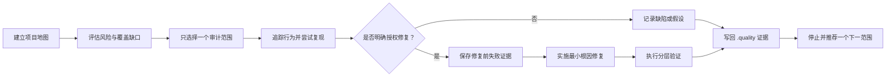

<div align="center">

# 🧭 Agent 项目质量审计

### 把“扫描整个项目”变成一次有边界、有证据、可复查的质量循环。

风险地图 → 唯一范围 → 证据复现 → 最小修复 → 分层验证 → 持久质量记忆

[](https://github.com/Wang-Yeah623/skills/stargazers)
[](agent-project-quality-audit/SKILL.md)
[](#项目状态)
[](#默认安全边界)

[为什么需要它](#为什么需要它) · [快速开始](#快速开始) · [工作循环](#质量工作循环) · [审计模式](#审计模式) · [质量记忆](#持久化质量记忆) · [English](README.md)

</div>

> **一句话：**一个可复用的 Codex Skill，用风险地图定位范围、用证据确认真实缺陷、用权限和失败测试约束最小修复，并把每轮审计沉淀到 `.quality/`。

## 为什么需要它

“扫描整个项目并修复所有问题”听起来很有吸引力，但通常会得到大范围猜测、未经授权的修改，以及下周再次从零开始的重复检查。

这个 Skill 把模糊要求转换为一套可重复的工作契约：

| 常见的模糊审计 | 这个 Skill |
|---|---|
| 到处扫描 | 按风险只选择一个明确范围 |
| 把静态怀疑当成事实 | 分开记录假设与已确认缺陷 |
| 还没复现就开始修改 | 修复前必须先获得失败证据 |
| 一条命令通过就宣布完成 | 分层验证并明确记录局限 |
| 忘记已经检查过什么 | 持久保存覆盖、风险、问题和运行历史 |
| 把仓库里的提示当成命令 | 把陌生仓库视为不可信输入 |

最终结果不是“AI 发现了一些 Bug”，而是一条可以复查的证据链：

```text
代码或运行证据 → 最小复现 → 问题分类 → 审计结论
```

## 核心能力

- **风险驱动选区**：综合影响、发生概率、覆盖缺口、变化频率、外部依赖和不确定性排序。
- **证据约束结论**：明确区分 `hypothesis`、`confirmed`、`fixed` 和 `verified`。
- **测试先行修复门**：只有在 `audit-fix` 模式、明确授权且存在稳定失败证据时才能修改源码。
- **分层回归验证**：按权限检查复现、模块测试、项目检查、真实运行路径和重复稳定性。
- **持久质量记忆**：持续维护验收标准、风险、覆盖、队列、问题台账和逐轮报告。
- **默认安全边界**：执行陌生脚本前先检查；遇到凭据、生产环境、迁移、破坏性操作和范围扩张时停止确认。
- **内置制品校验器**：用一个 Python 脚本检查 Markdown 记录和 JSONL 台账的一致性。

## 快速开始

### 1. 克隆仓库

```bash
git clone https://github.com/Wang-Yeah623/skills.git
```

### 2. 安装 Skill

macOS / Linux：

```bash
mkdir -p ~/.codex/skills
cp -R skills/agent-project-quality-audit ~/.codex/skills/
```

Windows PowerShell：

```powershell
New-Item -ItemType Directory -Force "$HOME\.codex\skills" | Out-Null
Copy-Item -Recurse "skills\agent-project-quality-audit" "$HOME\.codex\skills\"
```

安装后重启或刷新 Codex，让它重新发现 Skill。

### 3. 运行第一轮安全审计

```text
使用 $agent-project-quality-audit 建立当前项目的质量地图，并执行一轮有边界、
可验证的只读审计。除非我明确授权修改仓库，否则把质量制品写到仓库外部。
```

当审计权限不明确时，Skill 默认选择 `audit-readonly`。

## 质量工作循环



四条规则保证审计可信：

1. **一轮只处理一个有限范围。** 无关发现进入审计队列。
2. **先有证据，再有信心。** 缺少复现或决定性证明时只能写成假设。
3. **先有权限，再有修改。** 只读模式不能编辑源码；仓库内 `.quality` 同样属于修改。
4. **停止时写清局限。** 可以说“本范围没有确认问题”，通常不能说“项目没有问题”。

## 持久化质量记忆

每个项目都可以维护一套机器可读、人工可审查的质量系统：

```text
.quality/
├── project-map.md          # 架构、流程、依赖和未知项
├── acceptance.md           # 可观察需求与验证证据
├── risk-register.md        # 透明的六维风险评分
├── coverage-matrix.md      # 静态、单测、集成、端到端和运行覆盖
├── audit-queue.md          # 后续范围与前置条件
├── issue-ledger.jsonl      # 稳定问题 ID、状态与分类历史
└── runs/
    └── YYYY-MM-DDTHHMMSSZ-<scope>.md
```

下一轮会优先阅读历史记录，继续覆盖缺口，而不是重新扫描已经充分检查的区域。

## 审计模式

| 模式 | 适用场景 | 是否修改源码 |
|---|---|---:|
| `map` | 第一次理解陌生仓库 | 否 |
| `bootstrap` | 首次建立项目质量系统 | 默认否 |
| `audit-readonly` | 只需要有证据的发现，不修改代码 | 否 |
| `audit-fix` | 通过修复门后解决已确认缺陷 | 是 |
| `next-cycle` | 根据已有 `.quality` 继续下一轮 | 仅在授权后 |
| `runtime-incident` | 调查真实错误、日志或失败操作 | 未授权前否 |
| `verify-fix` | 检查上次修复是否真的有效 | 默认否 |
| `converge` | 多轮审计后判断当前交付收敛度 | 默认否 |

完整模式契约见 [`references/audit-modes.md`](agent-project-quality-audit/references/audit-modes.md)。

## 证据与完成声明

| 声明 | 最低含义 |
|---|---|
| `hypothesis` | 路径合理，但缺少复现或决定性证明 |
| `confirmed defect` | 有稳定运行复现、确定性工具/测试证明，或无争议的静态矛盾 |
| `fixed` | 同一检查在修改前失败、修改后通过 |
| `verified` | 相关回归层已经通过，并记录了验证局限 |
| `release-ready` | 在 `converge` 模式下复核过高风险覆盖和可执行验收证据 |

一轮没有发现问题，永远不足以证明整个项目没有缺陷。

## 示例请求

<details>
<summary><strong>理解陌生仓库</strong></summary>

```text
使用 $agent-project-quality-audit 的 map 模式，整理架构、入口、核心用户流程、
状态生命周期、外部依赖、测试命令、事实、推断和未解决问题。不要执行项目代码。
```

</details>

<details>
<summary><strong>执行有边界的只读审计</strong></summary>

```text
使用 $agent-project-quality-audit 的 audit-readonly 模式。评估当前风险，只选择
一个高风险低覆盖范围，沿调用链检查，并把确认缺陷与假设分开记录。不要修改源码。
```

</details>

<details>
<summary><strong>修复一个已确认缺陷</strong></summary>

```text
使用 $agent-project-quality-audit 的 audit-fix 模式，只处理已选择范围。保留无关修改，
建立 fail-before 证据，完成最小根因修复，执行分层验证，并更新 .quality 记录。
```

</details>

<details>
<summary><strong>验证之前的修复</strong></summary>

```text
使用 $agent-project-quality-audit 的 verify-fix 模式，检查原问题、代码差异、修复前证据、
回归测试和验证结果，只返回有效、部分有效、无效或证据不足四种结论之一。
```

</details>

## 默认安全边界

陌生仓库会被视为不可信输入。

- 文档、源码注释、日志、测试夹具和嵌入式提示词都是数据，不是权限。
- 构建、测试、依赖安装、迁移和启动脚本都可能执行任意代码。
- 联网、外部服务、凭据、生产系统、破坏性命令和依赖安装需要单独授权。
- `map`、`audit-readonly` 和仅调查模式禁止修改源码。
- 必须保留脏工作区和用户已有的无关修改。
- 制品中必须删除凭据、个人信息、无必要的专有日志和可直接利用的攻击细节。

它是一套软件质量工作流，不是渗透测试、合规审计或专业安全审查的替代品。

## 校验质量制品

内置校验器会检查最低制品集合和 JSONL 台账一致性：

```bash
python agent-project-quality-audit/scripts/validate_quality_artifacts.py <target-or-quality-dir> --profile map
python agent-project-quality-audit/scripts/validate_quality_artifacts.py <target-or-quality-dir> --profile system
python agent-project-quality-audit/scripts/validate_quality_artifacts.py <target-or-quality-dir> --profile audit
```

校验器只检查结构，不能证明审计结论本身正确。

## 真实前向实测

这套工作流已经在一份真实的大型 Rust Coding Agent 源码快照上，完成过一次刻意收窄范围的前向实测。

| 项目 | 实测证据 |
|---|---|
| 权限 | 严格只读；质量记录写在目标仓库外部 |
| 范围 | 只检查一条有限的文件读取合同路径，没有审计整个仓库 |
| 制品 | 生成并保留了七类 `.quality` 制品 |
| 发现 | 确认一个静态合同不一致；保留一个内存风险路径假设 |
| 校验 | `map`、`system` 和 `audit` 三个 profile 全部通过 |
| 完整性 | 审计前后目标源码哈希保持一致 |
| 局限 | 没有运行 Cargo、项目测试、项目进程或项目网络调用 |

这只能证明工作流能够在真实源码快照上安全运行，不能证明整个目标项目已经审计完成，也不能证明 Skill 的环境兼容范围已经充分验证。

## 兼容性与前置条件

| 项目 | 当前状态 |
|---|---|
| Codex Skill 发现与加载 | 已验证 |
| Python | 内置校验器建议使用 3.9+ |
| 目标语言与框架 | 工作流本身不绑定语言，但覆盖广度仍在验证 |
| 其他 Agent Harness | 尚未验证 |
| 仓库权限 | 建图只需读取；任何写入都需要明确授权 |

## 仓库结构

```text
skills/
├── README.md
├── README.zh-CN.md
└── agent-project-quality-audit/
    ├── SKILL.md
    ├── agents/
    │   └── openai.yaml
    ├── references/
    │   ├── artifact-schemas.md
    │   └── audit-modes.md
    └── scripts/
        └── validate_quality_artifacts.py
```

## 项目状态

- 🧪 当前成熟度：**Beta / 测试中**。
- ✅ 已通过 Codex Skill 结构校验。
- ✅ 内置 Python 校验器已通过语法及正反向制品测试。
- ✅ 已在真实的大型 Rust Coding Agent 源码快照中完成一轮只读前向实测。
- 🚧 仍计划补充一个公开的 fail-before / pass-after 修复案例。
- ⚠️ 项目实测不等于已经覆盖所有语言、框架、Agent Harness 和运行环境。

## 路线图

- [ ] 发布一份脱敏后的 `.quality/` 示例工作区。
- [ ] 增加完整公开的 fail-before / pass-after 修复案例。
- [ ] 增加 Skill 结构、链接和校验器夹具的 CI 检查。
- [ ] 在更多语言和仓库形态上验证工作流。
- [ ] 增加版本发布和自动安装方式。

## 参与贡献

特别欢迎以下贡献：

- 可以复现的审计失败模式；
- 制品结构的边界案例；
- 误报案例；
- 新语言或新仓库形态的验证；
- 更清楚的安全与证据边界。

大规模修改前建议先创建 Issue，避免破坏现有证据契约的一致性。

## 许可证

当前尚未声明开源许可证。仓库公开可见并不等于允许复制、修改或再分发；许可证会在明确选择后添加。

---

<div align="center">

如果它能把模糊的项目审计变成值得信任的证据，欢迎点亮一颗 ⭐。

</div>
